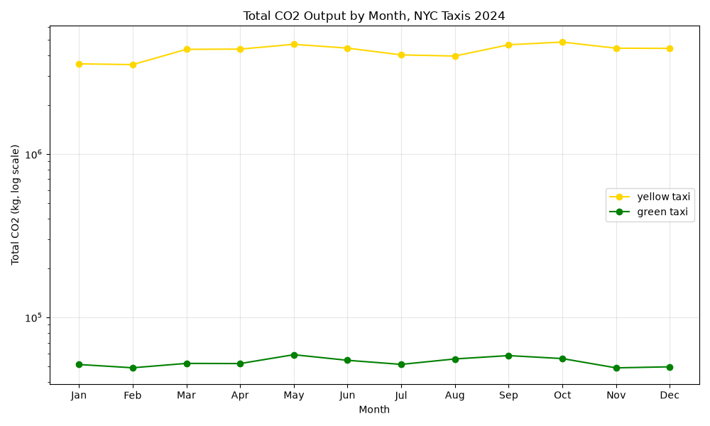

# DS 3022 Data Project 1: NYC Taxi CO2 Pipeline

Wilson Fredbeck — DS 3022, Fall 2026

This pipeline loads every 2024 YELLOW and GREEN NYC taxi trip into a local DuckDB database. It cleans out invalid trips, calculates CO2 output and time features for each trip, and reports when taxis are most and least carbon-heavy.

## How to run

```bash
python -m venv venv
source venv/bin/activate
pip install -r requirements.txt
python run.py
```

`run.py` runs the four stages in order and stops at the first failure. It works from any folder. Each stage can also be run on its own, from inside the project folder:

| Stage | Script | What it does | Log |
|---|---|---|---|
| Load | `load.py` | Builds `vehicle_emissions` (8 rows) from `data/vehicle_emissions.csv`. Loads all 24 monthly Parquet files (12 yellow + 12 green) directly from the NYC TLC URLs into `yellow_trips` and `green_trips`. Prints raw row counts and descriptive statistics. | `load.log` |
| Clean | `clean.py` | Removes duplicates, 0-passenger trips, 0-mile trips, trips over 100 miles and trips over 1 day (86,400 s). Runs a verification count after every delete to show the condition is now 0. | `clean.log` |
| Transform | `transform.py` | Adds `trip_co2_kgs`, `avg_mph`, `hour_of_day`, `day_of_week`, `week_of_year` and `month_of_year`. | `transform.log` |
| Analyze | `analysis.py` | Reports the largest CO2 trip and the heaviest/lightest hour, day, week and month for each cab type. Saves `co2_by_month.png`. | `analysis.log` |

A full run from an empty database takes about 1.5 minutes. Most of that is downloading the yellow taxi files.

## Design decisions

- **Only four columns are loaded.** The trip files have 20 columns, but the cleaning rules and transformations only use pickup time, dropoff time, passenger count and trip distance. Skipping the other 16 keeps the database smaller and the load faster.
- **Shared column names.** Yellow uses `tpep_pickup_datetime` and green uses `lpep_pickup_datetime`. Both are renamed to `pickup_time` / `dropoff_time` during the load, so `clean.py`, `transform.py` and `analysis.py` treat both tables the same way. They just loop over `("yellow_trips", "green_trips")`.
- **Files are loaded with a loop.** `load.py` builds each file's URL from the color and month and runs one `INSERT` per file inside a loop, rather than 24 hard-coded statements.
- **Two trip tables, not one.** Keeping yellow and green separate makes it clear which emissions rate applies. Every analysis question is also asked per cab type.
- **CO2 is looked up, not hard-coded.** `trip_co2_kgs` is calculated with a subquery against `vehicle_emissions` (`yellow_taxi` = 380 g/mi, `green_taxi` = 350 g/mi). If the CSV changes, the numbers follow.
- **Divide-by-zero guard.** `avg_mph` uses `NULLIF(duration, 0)`, so a trip with a 0-second duration gets `NULL` instead of an error.
- **Clean rules applied as written.** Only the five required rules are applied. Some odd rows remain. About 3.8M yellow trips have a `NULL` passenger count, but they still have valid distances and times, so they stay in the CO2 results. There are also about 70 trips with pickups outside 2024, too few to change any average.
- **Log-scale plot.** Yellow taxis produce about 80× more CO2 per month than green taxis, so the plot uses a log y-axis. Otherwise the green line would sit flat at zero.

## Results

Row counts:

| | Raw | After cleaning |
|---|---|---|
| yellow_trips | 41,169,720 | 39,436,749 |
| green_trips | 660,218 | 617,806 |
| vehicle_emissions | 8 | — |

Analysis (averages are CO2 per trip):

| Question | Yellow | Green |
|---|---|---|
| Largest single CO2 trip | 37.95 kg (99.86 mi, 2024-10-27) | 34.75 kg (99.28 mi, 2024-02-28) |
| Heaviest / lightest hour | 05:00 / 18:00 | 05:00 / 18:00 |
| Heaviest / lightest day | Sunday / Saturday | Sunday / Tuesday |
| Heaviest / lightest week | week 35 / week 51 | week 35 / week 3 |
| Heaviest / lightest month | August / February | August / January |

The heaviest hour is 5 AM because early-morning trips tend to be long (likely airport runs). The lightest is 6 PM, when rush-hour trips are short. Week 35 (late August, the end of summer travel) is the heaviest week for both cab types.


